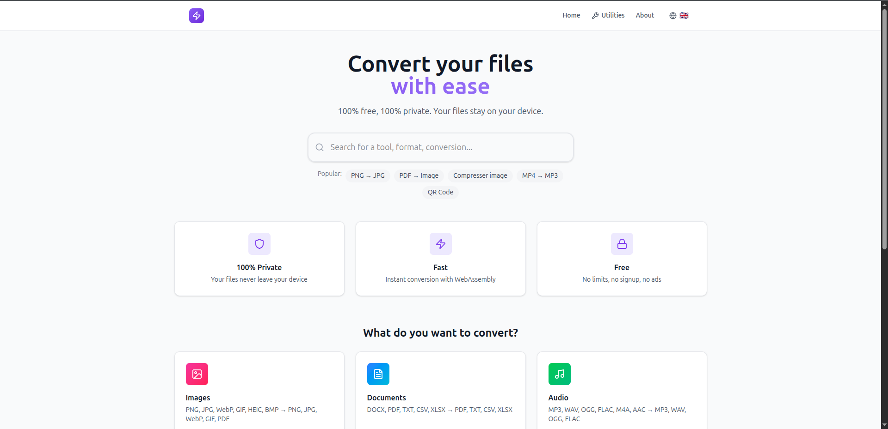
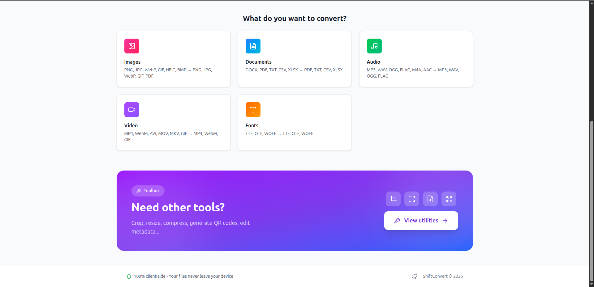
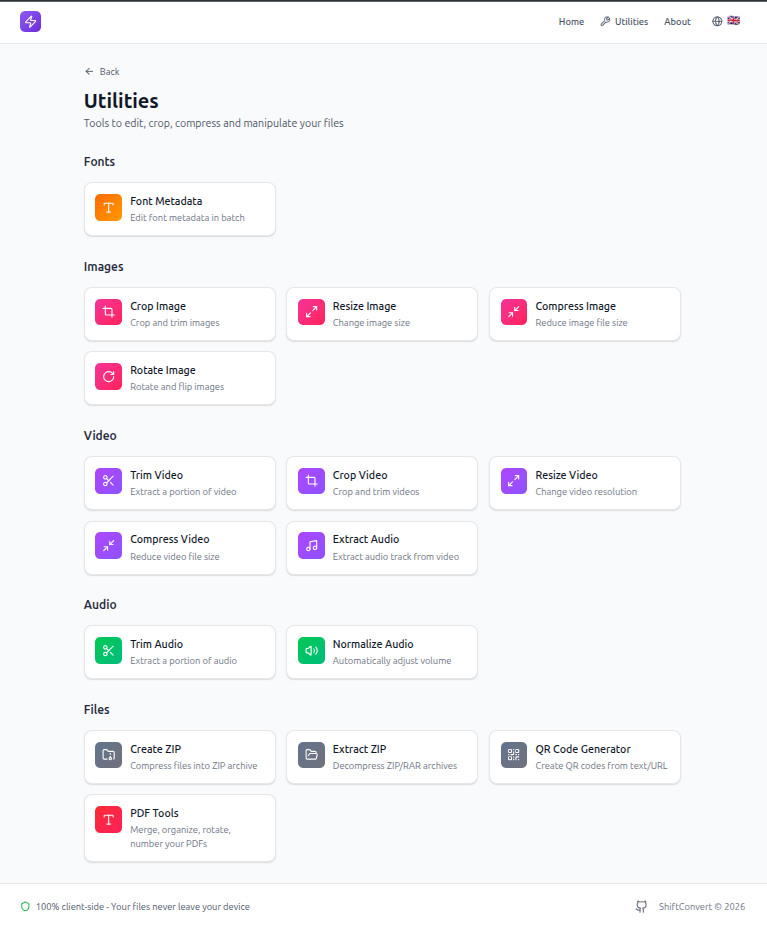
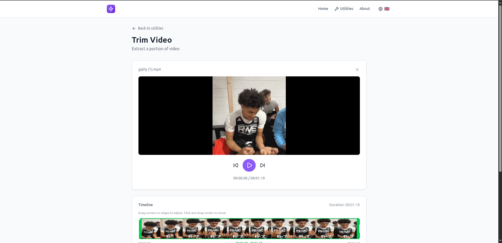
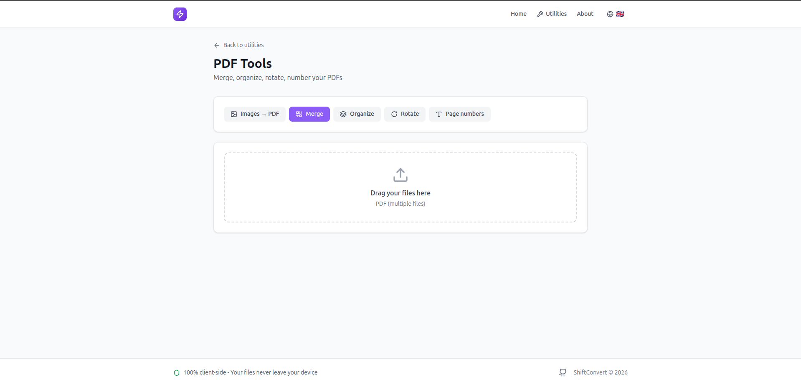

# ShiftConvert

**ShiftConvert** est une application web de conversion et d'édition multimédia qui fonctionne entièrement côté client. Aucun fichier n'est envoyé sur un serveur — tout le traitement se fait directement dans votre navigateur.



## Fonctionnalités

### Conversions de fichiers

Convertissez facilement entre de nombreux formats :

- **Images** : PNG, JPG, WebP, GIF, BMP, ICO, TIFF, HEIC
- **Vidéos** : MP4, WebM, AVI, MOV, MKV, GIF
- **Audio** : MP3, WAV, OGG, FLAC, AAC, M4A
- **Documents** : PDF, DOCX, Markdown, Excel, et plus



### Conversion d'images

Interface intuitive pour convertir vos images entre différents formats avec aperçu en temps réel.


### Utilitaires multimédia

Une suite complète d'outils pour éditer vos fichiers :



#### Vidéo
- **Découpage vidéo** — Extraire des segments avec timeline interactive
- **Recadrage vidéo** — Rogner avec préréglages de ratio (16:9, 9:16, 1:1...)
- **Redimensionnement** — Changer la résolution (4K, 1080p, 720p...)
- **Compression** — Réduire la taille avec contrôle de qualité
- **Extraction audio** — Extraire la piste audio en MP3, WAV ou AAC



#### Audio
- **Découpage audio** — Extraire des segments avec visualisation de forme d'onde
- **Normalisation** — Ajuster le volume automatiquement

#### Images
- **Redimensionnement** — Avec modes scale, cover, contain, fill
- **Compression** — Optimiser la taille des fichiers
- **Recadrage** — Rogner avec ratios prédéfinis
- **Rotation** — Pivoter et retourner

#### PDF
- **Fusion** — Combiner plusieurs PDF en un seul
- **Division** — Séparer un PDF en plusieurs fichiers
- **Réorganisation** — Changer l'ordre des pages
- **Numérotation** — Ajouter des numéros de page



#### Autres outils
- **Éditeur de métadonnées de polices** — Modifier les informations des fichiers de polices
- **Générateur de QR Code** — Créer des codes QR personnalisés
- **Création/Extraction ZIP** — Compresser et décompresser des archives

### Recherche intelligente

Trouvez rapidement la conversion ou l'outil dont vous avez besoin grâce à la barre de recherche.


## Technologies

- **React 19** + **TypeScript** — Interface utilisateur moderne et typée
- **Vite** — Build rapide et développement avec HMR
- **Tailwind CSS 4** — Styles utilitaires
- **FFmpeg.wasm** — Traitement vidéo/audio dans le navigateur
- **pdf-lib** / **pdfjs-dist** — Manipulation de PDF
- **Canvas API** — Traitement d'images

## Installation

```bash
# Cloner le projet
git clone https://github.com/romainpanno/shiftconvert.git
cd shiftconvert

# Installer les dépendances
npm install

# Lancer en développement
npm run dev

# Build de production
npm run build
```

## Scripts disponibles

| Commande | Description |
|----------|-------------|
| `npm run dev` | Lance le serveur de développement |
| `npm run build` | Compile pour la production |
| `npm run preview` | Prévisualise le build de production |
| `npm run lint` | Vérifie le code avec ESLint |

## Confidentialité

**Vos fichiers restent privés.** ShiftConvert traite tous les fichiers localement dans votre navigateur. Aucune donnée n'est envoyée à un serveur externe.

## Licence

MIT
